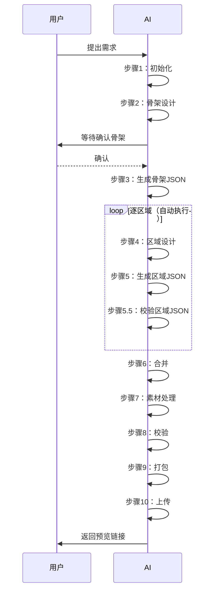

# CanvasVideo Skill

> 本 Skill 用于生成画布视频（H5 视频），支持创作模式和口播模式。
> AI 按步骤执行，每步完成后等待用户确认，再进入下一步。

---

## 流程图



---

## 步骤清单

| 步骤 | 操作 | 文档 |
|------|------|------|
| 1 | 初始化工作目录 | [01-init.md](docs/01-init.md) |
| 2 | 骨架设计 | [02-skeleton-design.md](docs/02-skeleton-design.md) |
| 3 | 生成 skeleton.json | [03-skeleton-build.md](docs/03-skeleton-build.md) |
| 4 | 区域设计 | [04-region-design.md](docs/04-region-design.md) |
| 5 | 生成区域 JSON | [05-region-build.md](docs/05-region-build.md) |
| 6 | 合并为 project.json | [06-merge.md](docs/06-merge.md) |
| 7 | 素材处理 | [07-assets.md](docs/07-assets.md) |
| 8 | 校验 | [08-validate.md](docs/08-validate.md) |
| 9 | 打包 | [09-package.md](docs/09-package.md) |
| 10 | 上传 | [10-upload.md](docs/10-upload.md) |

---

## 全局规则

### 硬约束（不得违反）

1. **第一次交互按模式区分必问**：
   - 先确定模式（创作 / 口播；含 `.srt/.mp3` 路径可自动判定）
   - 创作模式必问：**视频内容 + 时长 + 目标受众**
   - 口播模式必问：**音频路径 + SRT 字幕路径**
   - 主题、风格、BGM、视频比例等**全部非必问**（用默认值兜底）

2. **设计文档仅在本地**：不上传服务器

3. **设计确认后才上传**：`assertDesignConfirmed()` 拦截

4. **视频生成后不回设计**：所有迭代直接改 project.json

5. **固定 skillProjectId**：同一项目多次上传使用相同 ID，服务器复用 previewToken

6. **首次注册无感**：用户不需要主动注册，由 `getOrCreateUser` 自动完成

7. **首次告知必须强调**：⚠️ + 代码块 + 存放路径 + 风险提示，缺一不可

8. **非首次不再展示账号**：严禁在迭代或非首次场景输出 userToken

9. **查询账号只读本地**：绝不调用任何服务端接口

10. **不主动重置账号**：用户要重置时引导其手动删除 `.user.json`

11. **不打扰用户**：不主动删文件、不二次确认

### 文件结构

```
{workdirRoot}/{skillProjectId}/
├── design-skeleton.md          # 骨架设计（步骤2产出）
├── design-P1.md                # 区域1设计（步骤4产出）
├── design-P2.md                # 区域2设计（步骤4产出）
├── skeleton.json               # 骨架配置（步骤3产出）
├── regions/
│   ├── P1.json                 # 区域1配置（步骤5产出）
│   └── P2.json                 # 区域2配置（步骤5产出）
├── project.json                # 完整配置（步骤6产出）
├── assets/
│   ├── images/                 # 用户图片
│   └── placeholders/           # 占位素材
└── output.zip                  # 打包文件（步骤9产出）
```

### 关键路径

- **工作目录**：`{cwd}/canvasvideo-workdir/`
- **Skill 目录**：`{cwd}/canvasvideo-skill/`
- **服务器**：`http://8.147.60.112/cv/`

---

## 使用样例

### 首次创建视频

```js
const path = require('path');

// 1. 工作目录
const workdirRoot = path.resolve(process.cwd(), 'canvasvideo-workdir');

// 2. 项目状态
const state = require('./scripts/state').loadOrCreateProject(workdirRoot);
const skillProjectId = state.skillProjectId;

// 3. 按步骤执行
// 步骤1：初始化（见 docs/01-init.md）
// 步骤2：骨架设计（见 docs/02-skeleton-design.md）
// ... 以此类推
```

### 查询账号

```js
const { readLocalUser } = require('./scripts/upload-video');
const { user, error } = readLocalUser(workdirRoot);
if (user) {
  // 输出账号信息
} else if (error) {
  // 提示用户未注册
}
```

---

## 目录结构

```
canvasvideo-skill/
├── SKILL.md                    # 本文件（总导航）
├── docs/                       # 执行文档（AI 按步骤阅读）
│   ├── 01-init.md
│   ├── 02-skeleton-design.md
│   ├── 03-skeleton-build.md
│   ├── 04-region-design.md
│   ├── 05-region-build.md
│   ├── 06-merge.md
│   ├── 07-assets.md
│   ├── 08-validate.md
│   ├── 09-package.md
│   ├── 10-upload.md
│   └── references/             # 引用规则
│       ├── api-rules.md
│       ├── mode-rules.md
│       ├── layout-rules.md
│       ├── timing-rules.md
│       ├── selfcheck-rules.md
│       ├── principles.md
│       ├── themes-catalog.md
│       ├── components-catalog.md
│       └── visual-richness-rules.md
├── scripts/                    # 脚本工具
│   ├── init.js
│   ├── scaffold.js
│   ├── state.js
│   ├── query-api.js
│   ├── merge-regions.js
│   ├── validate.js
│   ├── package.js
│   ├── upload-video.js
│   └── selfcheck.js
├── templates/                  # 模板
│   ├── artifacts/              # 过程模板
│   │   ├── design-skeleton.md
│   │   └── design-region.md
│   ├── themes/                 # 主题配置
│   ├── bgm/                    # BGM 目录
│   └── projects/               # 项目示例
├── package.json
└── README.md
```
