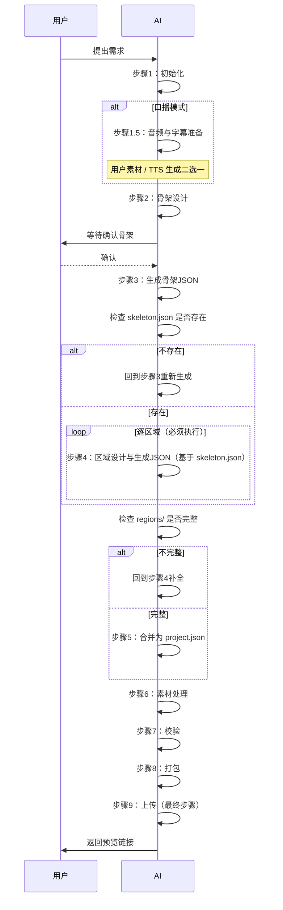

# CanvasVideo Skill

> 本 Skill 用于生成画布视频（H5 视频)，支持创作模式和口播模式。
> AI 按步骤执行，每步完成后等待用户确认，再进入下一步。

---

## 环境要求

| 项 | 要求 |
|---|---|
| Node.js | 16+（步骤 1.5 用了 node-edge-tts 要求 16+） |
| npm | 7+（用于 `npm install` 装依赖） |
| AI 工具 | 支持 Skill 协议 |
| 网络 | 首次上传需访问 `https://dajiulanren.top`；口播模式用 TTS 需访问 Azure 端点 |

**安装步骤**：`git clone` 后 `cd canvasvideo-skill && npm install`（装 `adm-zip` + `node-edge-tts`）。

**注意**：
- 步骤 1-7、9 不依赖 npm 包（只内置模块），步骤 1.5（仅 TTS 模式）和 8 需先 `npm install`
- 步骤 1.5 的"用户素材"模式不需要联网，**TTS 模式**才需要访问 Azure

---

## 流程图


```mermaid
sequenceDiagram
    participant 用户
    participant AI

    用户->>AI: 提出需求
    AI->>AI: 步骤1：初始化
    alt 口播模式
        AI->>AI: 步骤1.5：音频与字幕准备
        Note over AI: 用户素材 / TTS 生成二选一
    end
    AI->>AI: 步骤2：骨架设计
    AI->>用户: 等待确认骨架
    用户-->>AI: 确认
    AI->>AI: 步骤3：生成骨架JSON
    AI->>AI: 检查 skeleton.json 是否存在
    alt 不存在
        AI->>AI: 回到步骤3重新生成
    else 存在
        loop 逐区域（必须执行）
            AI->>AI: 步骤4：区域设计与生成JSON（基于 skeleton.json）
        end
    end
    AI->>AI: 检查 regions/ 是否完整
    alt 不完整
        AI->>AI: 回到步骤4补全
    else 完整
        AI->>AI: 步骤5：合并为 project.json
    end
    AI->>AI: 步骤6：素材处理
    AI->>AI: 步骤7：校验
    AI->>AI: 步骤8：打包
    AI->>AI: 步骤9：上传（最终步骤）
    AI->>用户: 返回预览链接
```

---

## 强制顺序

必须按以下顺序执行，**严禁跳过或颠倒**：

```
创作：步骤1 → 步骤2 → 步骤3 → [步骤4]循环 → 步骤5 → 步骤6 → 步骤7 → 步骤8 → 步骤9
口播：步骤1 → 步骤1.5 → 步骤2 → 步骤3 → [步骤4]循环 → 步骤5 → 步骤6 → 步骤7 → 步骤8 → 步骤9
```

关键依赖（阻断规则）：
- 没有 `skeleton.json` → **不能做**区域设计（步骤4）
- `regions/` 不完整 → **不能合并**（步骤5）
- 没有 `project.json` → **不能上传**（步骤9）
- **口播模式**：没有 `state.voice`（即没跑步骤1.5）→ **不能跑**步骤3（generate-skeleton.js 会报错）

## 步骤清单

| 步骤 | 操作 | 产出物 | 文档 | 模式 |
|------|------|--------|------|------|
| 1 | 初始化工作目录 | `state.json` | [01-init.md](docs/01-init.md) | 通用 |
| **1.5** | **音频与字幕准备**（用户素材 / TTS 生成） | `voice.mp3` + `subtitle.srt` + `state.voice` | [01.5-voice-prepare.md](docs/01.5-voice-prepare.md) | **仅口播** |
| 2 | 骨架设计（创作/口播） | `design-skeleton-*.md` | [02-skeleton-design-creative.md](docs/02-skeleton-design-creative.md) / [02-skeleton-design-dubbing.md](docs/02-skeleton-design-dubbing.md) | 通用 |
| 3 | 生成骨架JSON（必须） | `skeleton.json` | [03-skeleton-build.md](docs/03-skeleton-build.md) | 通用 |
| 4 | 区域设计与生成JSON（基于 skeleton） | `regions/P1.json`, `P2.json`... | [04-region-design-creative.md](docs/04-region-design-creative.md) / [04-region-design-dubbing.md](docs/04-region-design-dubbing.md) | 通用 |
| 5 | 合并为 project.json | `project.json` | [05-merge.md](docs/05-merge.md) | 通用 |
| 6 | 素材处理 | 资源文件 | [06-assets.md](docs/06-assets.md) | 通用 |
| 7 | 校验 | 校验报告 | [07-validate.md](docs/07-validate.md) | 通用 |
| 8 | 打包 | `<skillProjectId>.zip` | [08-package.md](docs/08-package.md) | 通用 |
| 9 | 上传（最终步骤） | 预览链接 | [09-upload.md](docs/09-upload.md) | 通用 |

---

## 全局规则

### 硬约束（不得违反）

1. **设计文档仅在本地**：不上传服务器

2. **设计确认后才上传**：由 AI 流程自行保证（不通过脚本硬拦）

3. **视频生成后不回设计**：所有迭代直接改 project.json

4. **固定 skillProjectId**：同一项目多次上传使用相同 ID，服务器复用 previewToken

   **何时换 ID**：用户要做新主题/新内容时，由 AI 加 `--new` 标志显式切换，详见 [rules/01-principles.md §R2](rules/01-principles.md#r2-项目新建-vs-沿用)。脚本会打 📌 / 🆕 / 🔄 三种日志明确决策结果，AI 必须原样转发给用户。

5. **首次注册无感**：用户不需要主动注册，由 `getOrCreateUser` 自动完成（init-project 时即触发）

6. **首次告知必须强调**：⚠️ + 代码块 + 存放路径 + 风险提示，缺一不可

7. **非首次不再展示账号**：严禁在迭代或非首次场景输出 userToken

8. **查询账号只读本地**：绝不调用任何服务端接口

9. **不主动重置账号**：用户要重置时引导其手动删除 `.user.json`

10. **不打扰用户**：不主动删文件、不二次确认

11. **skillProjectId 必须走脚本**：禁止 LLM 自编，格式 `cv_{userShort6}_{timestamp}_{random8}`，详见 [rules/01-principles.md §R6](rules/01-principles.md#r6-skillprojectid-规范)

### 文件结构

```
{workdirRoot}/{skillProjectId}/
├── design-skeleton-creative.md # 骨架设计（创作模式）
├── design-skeleton-dubbing.md  # 骨架设计（口播模式）
├── skeleton.json               # 骨架配置（步骤3产出）
├── regions/
│   ├── P1.json                 # 区域1配置（步骤4产出）
│   └── P2.json                 # 区域2配置（步骤4产出）
├── project.json                # 完整配置（步骤5产出）
├── assets/
│   ├── images/                 # 用户图片
│   └── placeholders/           # 占位素材
└── <skillProjectId>.zip       # 打包文件（步骤8产出）
```

### 关键路径

- **工作目录**：`{cwd}/canvasvideo-workdir/`
- **Skill 目录**：`{cwd}/canvasvideo-skill/`
- **服务器**：`https://dajiulanren.top/`

---

## 使用样例

### 首次创建视频

```js
const path = require('path');

// 1. Agent 工作目录（由 AI 传入的绝对路径）
const agentWorkdir = process.env.AGENT_WORKDIR || path.resolve(process.cwd(), '..');

// 2. canvasvideo-workdir 固定在 Agent 工作目录下
const workdirRoot = path.join(agentWorkdir, 'canvasvideo-workdir');

// 3. 项目状态
const state = require('./scripts/state').loadOrCreateProject(workdirRoot);
const skillProjectId = state.skillProjectId;

// 4. 按步骤执行
// 步骤1：初始化（见 docs/01-init.md）
// 步骤2：骨架设计（见 docs/02-skeleton-design-creative.md 或 02-skeleton-design-dubbing.md）
// ... 以此类推
```

### 查询账号

```js
const { readLocalUser } = require('./scripts/upload-video');
const { user, error } = readLocalUser(workdirRoot);
if (user) {
  // 输出账号信息
} else if (error) {
  // 提示用户未注册
}
```

---

## 目录结构

```
canvasvideo-skill/
├── SKILL.md                    # 本文件（总导航）
├── docs/                       # 执行文档（AI 按步骤阅读）
│   ├── 01-init.md
│   ├── 02-skeleton-design-creative.md
│   ├── 02-skeleton-design-dubbing.md
│   ├── 03-skeleton-build.md
│   ├── 04-region-design-creative.md
│   ├── 04-region-design-dubbing.md
│   ├── 05-merge.md
│   ├── 06-assets.md
│   ├── 07-validate.md
│   ├── 08-package.md
│   └── 09-upload.md
├── rules/                      # 约束规则（AI 设计时查阅）
│   ├── RULES.md                # 规则总清单
│   ├── 01-principles.md
│   ├── 06-components.md
│   ├── 08-api.md
│   └── 09-selfcheck.md
├── scripts/                    # 脚本工具
│   ├── srt-parser.js
│   ├── scaffold.js
│   ├── state.js
│   ├── query-api.js
│   ├── merge-regions.js
│   ├── validate.js
│   ├── package.js
│   ├── upload-video.js
│   └── selfcheck.js
├── templates/                  # 模板
│   ├── artifacts/              # 过程模板（仅骨架设计文档）
│   │   ├── design-skeleton-creative.md
│   │   └── design-skeleton-dubbing.md
│   ├── bgm/                    # BGM 目录
│   └── projects/               # 项目示例
├── package.json
└── README.md
```
