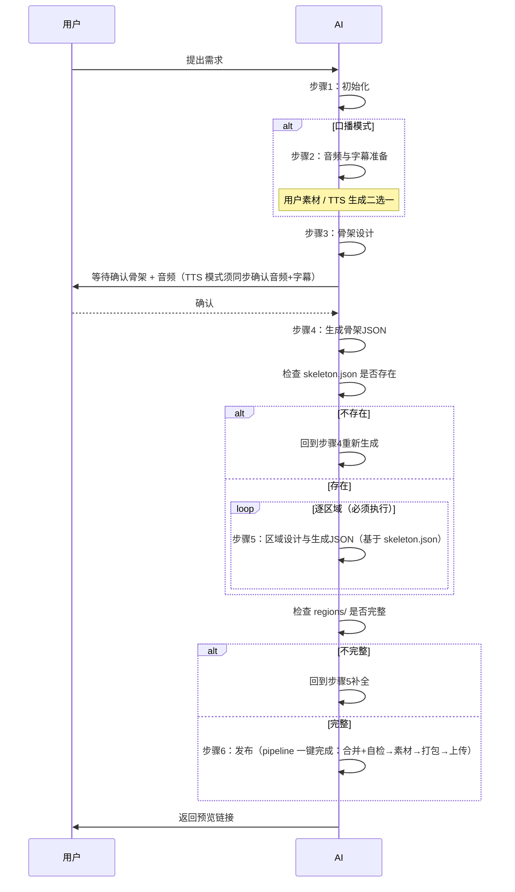

# CanvasVideo Skill

CanvasVideo Skill 帮助 AI 生成高质量 CanvasVideo 视频。

---

## 环境要求

| 项 | 要求 |
|---|---|
| Node.js | 16+（步骤 2 用了 node-edge-tts 要求 16+） |
| npm | 7+（用于 `npm install` 装依赖） |
| Python | 3.8+（可选，仅在 JS TTS 失败 fallback 或强制使用 Python 兜底时需要） |
| pip | 最新版（用于 `pip install websockets`） |
| AI 工具 | 支持 Skill 协议 |
| 网络 | 首次上传需访问 `https://dajiulanren.top`；口播模式用 TTS 需访问 Azure 端点 |

**安装步骤**：`git clone` 后 `cd canvasvideo-skill && npm install`（装 `adm-zip` + `node-edge-tts`）；如需 Python TTS 兜底，再 `pip install websockets`。

**注意**：
- 步骤 1、3、4、5 不依赖 npm 包（只内置模块），步骤 2（仅 TTS 模式）需 `npm install`
- 步骤 6（pipeline）需要 `adm-zip`（package.js 内部依赖）
- 步骤 2 的"用户素材"模式不需要联网，**TTS 模式**才需要访问 Azure
- **TTS 双后端**：`prepare-voice.js` 支持 `--tts=auto|js|py`。`auto`（默认）= 先 JS 失败再 Python 兜底；`js` = 仅 `node-edge-tts`；`py` = 仅 `edge_tts_py.py` 兜底脚本。详见 [docs/02-voice-prepare.md § TTS 双后端](docs/02-voice-prepare.md#tts-双后端)

---

## 流程图


```mermaid
sequenceDiagram
    participant 用户
    participant AI

    用户->>AI: 提出需求
    AI->>AI: 步骤1：初始化
    alt 口播模式
        AI->>AI: 步骤2：音频与字幕准备
        Note over AI: 用户素材 / TTS 生成二选一
    end
    AI->>AI: 步骤3：骨架设计
    AI->>用户: 等待确认骨架 + 音频（TTS 模式须同步确认音频+字幕）
    用户-->>AI: 确认
    AI->>AI: 步骤4：生成骨架JSON
    AI->>AI: 检查 skeleton.json 是否存在
    alt 不存在
        AI->>AI: 回到步骤4重新生成
    else 存在
        loop 逐区域（必须执行）
            AI->>AI: 步骤5：区域设计与生成JSON（基于 skeleton.json）
        end
    end
    AI->>AI: 检查 regions/ 是否完整
    alt 不完整
        AI->>AI: 回到步骤5补全
    else 完整
        AI->>AI: 步骤6：发布（pipeline 一键完成：合并+自检→素材→打包→上传）
    end
    AI->>用户: 返回预览链接
```

---

## 强制顺序

必须按以下顺序执行，**严禁跳过或颠倒**：

```
步骤1 → 步骤2 → 步骤3 → 步骤4 → [步骤5]循环 → 步骤6
```

关键依赖（阻断规则）：
- 没有 `skeleton.json` → **不能做**区域设计（步骤5）
- `regions/` 不完整 → **不能发布**（步骤6 pipeline 内会立即报错）
- **口播模式**：没有 `state.voice`（即没跑步骤2）→ **不能跑**步骤4（generate-skeleton.js 会报错）

## 步骤清单

| 步骤 | 操作 | 产出物 | 流程 | 脚本 | 样例 | 规则 |
|------|------|--------|------|------|------|------|
| 1 | 初始化工作目录 | `state.json` | [01-init.md](docs/01-init.md) | `init-project.js` | — | [01-principles.md](rules/01-principles.md) |
| **2** | **音频与字幕准备** | `voice.mp3` + `subtitle.srt` + `state.voice` | [02-voice-prepare.md](docs/02-voice-prepare.md) | `tts.js` / `prepare-voice.js` | — | [06-components.md §R0](rules/06-components.md#r0-项目级必填字段总览)（mode） |
| 3 | 骨架设计 | `design-skeleton-dubbing.md` | [03-skeleton-design-dubbing.md](docs/03-skeleton-design-dubbing.md) | — | `templates/artifacts/design-skeleton-dubbing.md` | [06-components.md](rules/06-components.md) |
| 4 | 生成骨架JSON | `skeleton.json` | [04-skeleton-build.md](docs/04-skeleton-build.md) | `generate-skeleton.js` | `templates/projects/分合示例-口播/` | [06-components.md §R0](rules/06-components.md#r0-项目级必填字段总览)（subtitle/mode） |
| 5 | 区域设计与生成JSON | `regions/P1.json`, `P2.json`... | [05-region-design-dubbing.md](docs/05-region-design-dubbing.md) | — | — | [06-components.md §R12](rules/06-components.md#r12-元素动效ai-写-cssmerge-严格校验)（原生 CSS @keyframes） + [§R15](rules/06-components.md#r15-data--参数规范ai-只写-data-subtitle)（AI 只写 data-subtitle，merge 自动补 data-global） |
| **6** | **发布**（合并+自检 → 素材 → 打包 → 上传） | `project.json` + `.zip` + 预览链接 | [06-publish.md](docs/06-publish.md) | `pipeline.js`（内含 `merge-regions.js` + `validate.js` + `setup-assets.js` + `package.js` + `upload-video.js`） | — | [09-selfcheck.md](rules/09-selfcheck.md) |

---

## 全局规则

### 硬约束（不得违反）

0. **严格按流程执行**：CanvasVideo Skill 有严格 6 步流程，AI 必须按顺序执行每一步（设计→骨架→区域→发布），不得跳步或省略环节。

1. **视频生成后修改需要重新走流程**：迭代时先改骨架设计文档/区域JSON，再重跑 `node scripts/pipeline.js`，禁止直接改 project.json（上次流程产物的中间状态会被覆盖）

1b. **需要 AI 直接生成的只有以下 3 项**：口播文案（用户未提供时）、骨架设计文档、区域 JSON。其余一切必须走脚本（init-project / generate-skeleton / pipeline / upload-video.js 等），禁止手写 JSON 或跳过流程。

4. **固定 skillProjectId**：同一项目多次上传使用相同 ID，服务器复用 previewToken

   **何时换 ID**：用户要做新主题/新内容时，由 AI 加 `--new` 标志显式切换，详见 [rules/01-principles.md §R2](rules/01-principles.md#r2-项目新建-vs-沿用)。脚本会打 📌 / 🆕 / 🔄 三种日志明确决策结果，AI 必须原样转发给用户。

5. **首次注册无感**：用户不需要主动注册，由 `getOrCreateUser` 自动完成（init-project 时即触发）

6. **首次告知必须强调**：⚠️ + 代码块 + 存放路径 + 风险提示，缺一不可

7. **非首次不再展示账号**：严禁在迭代或非首次场景输出 userToken

8. **查询账号只读本地**：绝不调用任何服务端接口

9. **不主动重置账号**：用户要重置时引导其手动删除 `.user.json`

10. **skillProjectId 必须走脚本**：禁止 LLM 自编，格式 `cv_{userShort6}_{timestamp}_{random8}`，详见 [rules/01-principles.md §R6](rules/01-principles.md#r6-skillprojectid-规范)

### 视频文件结构

```
{workdirRoot}/{skillProjectId}/
├── design-skeleton-dubbing.md  # 骨架设计（口播模式）
├── skeleton.json               # 骨架配置（步骤4产出）
├── regions/
│   ├── P1.json                 # 区域1配置（步骤5产出）
│   └── P2.json                 # 区域2配置（步骤5产出）
├── project.json                # 完整配置（步骤6 pipeline 合并后）
├── assets/
│   ├── images/                 # 用户图片
│   ├── voice/                  # 配音音频
│   └── subtitles/              # 字幕
└── <skillProjectId>.zip       # 打包文件（步骤6 pipeline 打包后）
```

### 关键路径

- **工作目录**：`{cwd}/canvasvideo-workdir/`
- **Skill 目录**：`{cwd}/canvasvideo-skill/`
- **服务器**：`https://dajiulanren.top/`

---

## 使用样例

### 首次创建视频

```js
const path = require('path');

// 1. Agent 工作目录（由 AI 传入的绝对路径）
const agentWorkdir = process.env.AGENT_WORKDIR || path.resolve(process.cwd(), '..');

// 2. canvasvideo-workdir 固定在 Agent 工作目录下
const workdirRoot = path.join(agentWorkdir, 'canvasvideo-workdir');

// 3. 项目状态
const state = require('./scripts/state').loadOrCreateProject(workdirRoot);
const skillProjectId = state.skillProjectId;

// 4. 按步骤执行
// 步骤1：初始化（见 docs/01-init.md）
// 步骤2：音频与字幕准备（见 docs/02-voice-prepare.md）
// 步骤3：骨架设计（见 docs/03-skeleton-design-dubbing.md）
// 步骤4：生成骨架JSON（见 docs/04-skeleton-build.md）
// 步骤5：区域设计（见 docs/05-region-design-dubbing.md）
// 步骤6：发布（一键完成，见 docs/06-publish.md）
//   node scripts/pipeline.js --cwd=<Agent工作目录> <skillProjectId>
```

### 查询账号

```js
const { readLocalUser } = require('./scripts/upload-video');
const { user, error } = readLocalUser(workdirRoot);
if (user) {
  // 输出账号信息
} else if (error) {
  // 提示用户未注册
}
```

---

## 目录结构

```
canvasvideo-skill/
├── SKILL.md                    # 本文件（总导航）
├── README.md                   # 项目介绍（人类读）
├── docs/                       # 执行文档（AI 按步骤阅读）
│   ├── 01-init.md              # 步骤1：初始化
│   ├── 02-voice-prepare.md     # 步骤2：音频与字幕准备（口播）
│   ├── 03-skeleton-design-dubbing.md  # 步骤3：骨架设计（口播）
│   ├── 04-skeleton-build.md    # 步骤4：生成骨架JSON
│   ├── 05-region-design-dubbing.md    # 步骤5：区域设计与JSON
│   └── 06-publish.md           # 步骤6：发布（合并+自检→素材→打包→上传）
├── rules/                      # 约束规则（AI 设计时查阅）
│   ├── RULES.md                # 规则总清单
│   ├── 01-principles.md
│   ├── 06-components.md
│   ├── 08-api.md
│   └── 09-selfcheck.md
├── scripts/                    # 脚本工具
│   ├── srt-parser.js
│   ├── scaffold.js
│   ├── state.js
│   ├── query-api.js
│   ├── init-project.js
│   ├── generate-skeleton.js
│   ├── merge-regions.js        # 步骤6 pipeline 内部调用
│   ├── validate.js             # 步骤6 pipeline 内部调用
│   ├── setup-assets.js         # 步骤6 pipeline 内部调用
│   ├── package.js              # 步骤6 pipeline 内部调用
│   ├── upload-video.js         # 步骤6 pipeline 内部调用
│   ├── pipeline.js             # 步骤6 一键入口
│   ├── selfcheck.js
│   ├── transform-html-component.js
│   └── ...
├── templates/                  # 模板与样例
│   ├── artifacts/              # 骨架设计模板（口播）
│   │   └── design-skeleton-dubbing.md
│   └── projects/               # 项目样例
│       └── 分合示例-口播/
├── package.json
└── README.md
```